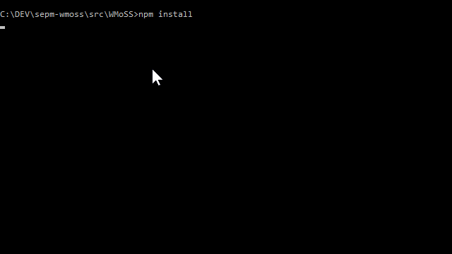
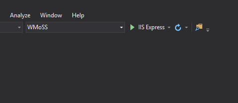
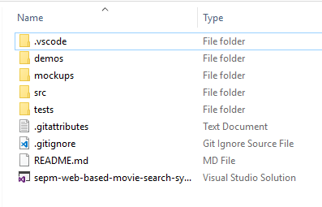
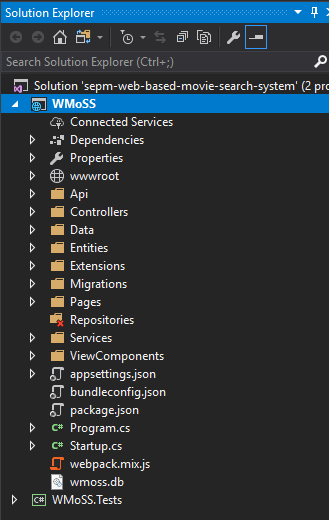

# Cinema Aurora Web-based Movie Search System Project Documentation

Cinema Aurora Web-based Movie Search System is implemented as a website to showcase and sell movie tickets. These are the 2 core features of the site:
- Guest can browse and search movies
- Guess can purchase tickets

## Table of Contents
- [Developed By](#developed_by)
- [Requirements](#requirements)
- [Downloading the Project Files](#downloading_project)
- [How to run project locally?](#running_project_locally)
- [Project Structure](#project_structure)
- [Server Side](#server_side)
- [Deployment](#deployment)
- [How to run website in a budget Linux server?](#running_on_remote_linux_server)
- [FAQ](#faq)

### Developed by
- Amanda Argyros
- James McIntyre
- Melika Nafarieh
- Joshua Orozco

### Requirements
- Visual Studio 2017
- Node JS v6.x or higher
- Node Package Manager (NPM) v3.x
- .NET Core 2.0 or higher

### Downloading the project files
In Github, download the project as a zip file, or clone the project using:
<pre>git clone https://github.com/rmit-s3588941-amanda-argyros/sepm-wmoss</pre>

Note: This is a <b>private repository</b> so you will need to have access. 

### How to run project locally?
1. If you have downloaded the file as a zip, extract it. 
2. Navigate to the project directory using the command prompt.
3. In the root directory of the project, navigate to <code>src/WMoSS</code> folder.
4. Install node dependencies using the command <code>npm install</code>. Installation may take a long time for the first time.
5. Next, is compile all front-end assets using the <code>npm run dev</code>. 
    
6. After you have compiled the asset files, in the root folder, look for a file called <code>sepm-web-based-movie-search-system.sln</code>. Open it using Visual Studio 2017.
7.  Run the project by clicking the "IIS Express" button. If you are running this on the first time, this will take a long time. 

8. Your browser will automatically launch and you will see the home page.

### Project Structure
 
- *vscode* - The .vscode folder contains necessary files to run the project in a text editor called "Visual Studio Code". 
- *demos* - Example GIF demos on how a user can browse the site
- *mockups* - Contains HTML, CSS, SCSS, Javascript and images used to make website mockups
- *src* - Folder that contains server side code.
- *tests* - Unit and integration tests are located here
- *.gitattributes* - Used when working with Git
- *.gitignore* - List of files and folders that will ignored and will not be commited are inside this files
- *README.md* - Contains instructions for developers
- *sepm-web-based-movie-search-system.sln* - The solution file for Visual Studio 2017

### Server Side
 
We used ASP.NET web development framework to build the site. Many movie websites and other business websites are built with the same framework.
- *Dependencies* - Contains NuGet and NPM dependencies
- *Properties* - Contains launch configuration settings
- *wwwroot* - Asset files such as CSS, JS, images and SCSS files are located here
- *Api* - API Controller classes live in this folder
- *Controllers* - Contains controller file. This folder is autogenerated when the project is first built.
- *Data* - Files that deal with data access
- *Entities* - Model entity classes
- *Extensions* - Static classes that extends functionalities of existing classes
- *Migrations* - Database migration files
- *Pages* - View files for ASP.NET framework (Razor Pages)
- *Repositories* - Data abstraction classes (This folder is empty)
- *Services* - Contains classes that represents a services (eg. email service, phone service, etc)
- *ViewComponents* - Classes to manages view components
- *appsettings.json* - Main configuration file
- *bundleconfig.json* - For bundling Bower dependencies
- *package.json* - For bundling NPM dependencies
- *Program.cs* - C# entry file. Contains the <code>main()</code> method
- *Startup.cs* - File has handles MVC setup, dependency injection and database setup
- *webpack.mix.js* - Configuration file to compile front-end assets using Laravel Mix
- *wmoss.db* - Source of data. SQLite database

### Deployment
Note: Deployment is a complex topic. We may miss many things in this documentation

Basically in order to host the website in the internet, you need to rent a private server. Cloud providers offers cheap VPS hosting on the internet ($5.00 per month is the minimum). Good examples of Cloud  providers include:
 - DigitalOcean
 - Vultr
 - Linode
 - Amazon Web Services (free unlimited server instance for 12 months)
 - Google Cloud (1 free server instance forever but has very limited resource)

 In theory, a website written in ASP.NET Core can run on a free instance in Google Cloud even with limited resources.

### How to run website in a budget Linux server?
By default, the website runs in something called Kestrel server. Microsoft recommends running the ASP.NET Core website behind a reverse proxy server like Nginx. You will have to read online docs on how to set it up.

Alternatively, you can run the website without Nginx.

Make sure you have acess to the remote linux server. Also make sure NodeJS, NPM and .NET Core SDK are installed. You have to read online docs on how to install those.

After everything is installed and setup:
- Clone the website to the remote linux server using :
<pre>git clone https://github.com/rmit-s3588941-amanda-argyros/sepm-wmoss</pre>
- Inside the directory of the cloned project, navigation to <code>src/WMoSS</code>
- Download NPM dependencies using <code>npm install</code>.
- Compile front-end assets using <code>npm run dev</code>.
- Download packages for the ASP.NET Core project using <code>dotnet restore</code>
- Run the website using <code>dotnet run</code>. It will run the server to port 5000 by default.
- Launch your web browser and navigate to <code>http://XXX.XXX.XXX.XXX:5000</code> where XXX.XXX.XXX.XXX represents the IP address of the remote linux server.

### Frequently Asked Questions
- **Is the website complete?** 
No, many things are still incomplete such as theaters page. There are still layout issues and bugs
- **What technology stack do you use?** 
ASP.NET Core, SCSS, jQuery, ReactJS
- **How can we add new movies and movie sessions?** 
You cannot. There is no easy way. The only way to add movies, sessions, etc is to run SQL commands on terminal. Furthermore, admin functionality is not mentioned in the requirements.
- **Originally the requirements says data will be stored in files. Why did you use database instead of using files?** 
Since we are using ASP.NET, we rely heavy on its ORM (Entity Framework) to get data. The problem is the ORM works only on database. Also writing code with files as source of data is challenging in ASP.NET. We would have to write lots of custom code. Fortunately we were given permission to use database instead of using files.

